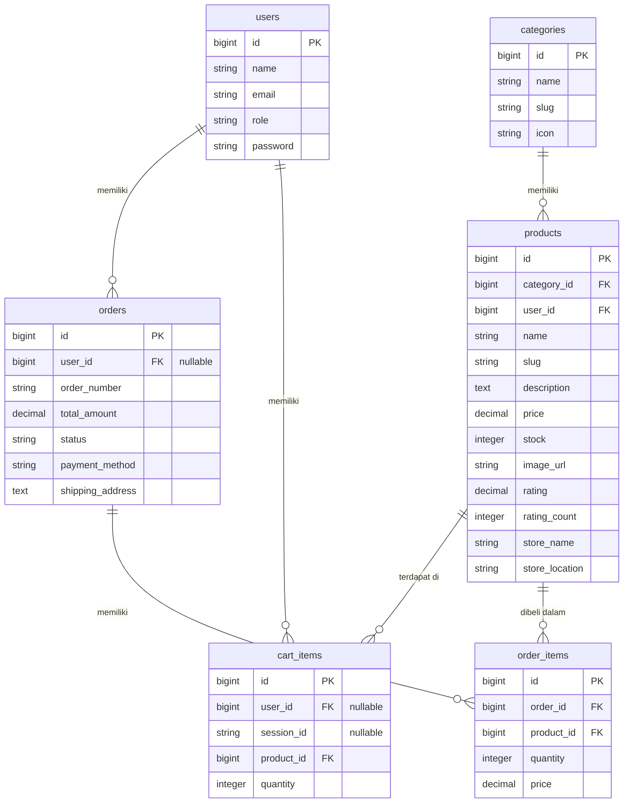

# Arsitektur Projek: TokoGreen E-Commerce

Dokumen ini menjelaskan struktur arsitektur, basis data, dan keputusan teknologi yang digunakan dalam proyek **TokoGreen**.

## 1. Konsep Desain & Panduan Gaya (Style Guide)
TokoGreen dirancang dengan estetika premium yang bersih (clean) dan responsif.
* **Warna Utama**: Putih (`#FFFFFF`) untuk latar belakang bersih, memberikan kesan lapang dan modern.
* **Warna Teks**: Hitam (`#000000` / `#1A1A1A`) untuk kontras tinggi dan kenyamanan membaca.
* **Warna Aksen**: Hijau (`#03AC0E`) digunakan untuk tombol tindakan utama (primary action), lencana promosi, status sukses, dan elemen interaktif.
* **Tipografi**: Menggunakan kombinasi font Google:
  * **Inter**: Untuk teks isi (body copy), harga, dan elemen navigasi (kontras tinggi, modern).
  * **Outfit**: Untuk judul besar, nama produk detail, dan nama brand di Navbar (kesan premium & futuristik).

---

## 2. Tech Stack
* **Backend**: Laravel 11 (Framework PHP MVC modern).
* **Frontend**: React (dengan TypeScript) berjalan di atas **Inertia.js** (tanpa memerlukan REST API terpisah, monorepo yang sangat efisien).
* **Styling**: Bootstrap 5 + Bootstrap Icons untuk penataan responsif cepat, dengan kustomisasi CSS minimalis di `app.css`.
* **Database**: SQLite (sangat portabel untuk demonstrasi lokal instant).

---

## 3. Skema Basis Data (Database Schema)

Aplikasi menggunakan 5 tabel utama untuk menangani siklus e-commerce:

---

## 4. Alur Integrasi (Inertia.js Data Flow)
Inertia.js bertindak sebagai jembatan yang menghubungkan Laravel routing langsung dengan komponen React tanpa perlu menulis REST API / CORS secara terpisah.

1. **Routing & Controller (Laravel)**:
   * Controller memproses kueri database (misalnya mengambil daftar produk berdasarkan kategori).
   * Mengembalikan `Inertia::render('Home', $data)`.
2. **HandleInertiaRequests Middleware**:
   * Membagikan state global secara otomatis ke seluruh komponen React, seperti:
     * `auth.user` (informasi login pengguna saat ini).
     * `cartCount` (total jumlah barang di keranjang).
     * `flash` (pesan sukses/gagal).
3. **Frontend (React + TypeScript)**:
   * Komponen menerima data sebagai React Props.
   * `router.post()` / `router.put()` digunakan untuk mengirimkan data ke backend secara asinkron tanpa reload halaman penuh (Single Page Application experience).
